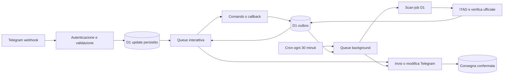

# Mappa dell'architettura

Un Worker gestisce HTTP, cron e due consumer. D1 conserva stato, lavori e outbox; Queues trasporta riferimenti ai lavori. Le regole sono in funzioni pure; client esterni e SQL restano nell'infrastruttura.

```text
src/
├── index.ts                 composizione degli handler Workers
├── runtime/                 binding, webhook, consumer e routing Queue
├── application/             contesto, scheduler, scansioni, update, consegne, tempi
├── domain/                  modelli, ribassi, promozioni, URL
├── telegram/                comandi, callback, guida, formattazione e wishlist
└── infrastructure/
    ├── http.ts              timeout ed errori sanitizzati
    ├── itad/client.ts       ricerca, prezzi, giveaway e recensioni
    ├── stores/verification.ts conferma ufficiale Epic/Steam
    ├── telegram/client.ts   API Telegram
    └── d1/                  repository specializzati
migrations/                  migrazioni SQL additive ordinate
scripts/migration/           export e import privati del vecchio stato
scripts/diagnostics/         benchmark, probe, query aggregate
tests/                      stesse responsabilità, fixture SQLite
legacy/python/               implementazione storica, non avviata dal deploy
```

## Flussi e persistenza



Il webhook salva l'update prima dell'ack. Se la pubblicazione fallisce, Telegram ritenta e il recupero periodico ritrova l'ID. Il consumer acquisisce un lease: replay e invii già confermati non duplicano la consegna. Un invio riuscito prima di un crash nella conferma D1 può essere ripetuto: il raro duplicato è accettato per ridurre gli avvisi persi.

Le reply sono instradate sulla Queue interattiva; avvisi prezzi/giveaway e scansioni su quella background. Entrambi i consumer hanno batch 1 e concorrenza 1. Il fallback sulla vecchia Queue consente transizione e recupero dei job già pubblicati. Le scansioni sospese non impediscono /help o /wishlist.

Le pagine wishlist contengono al massimo dieci giochi e HTML entro 3800 caratteri. I prezzi vengono richiesti all'apertura di ogni pagina. Il callback conserva chat e proprietario, accoda una edit persistita verso il message_id esistente e usa update_id come revisione. Un'edit superata da una revisione più recente viene scartata. Telegram «message is not modified» conta come successo; un messaggio eliminato produce un solo invito a riaprire /wishlist. 429 conserva retry_after e 403 mette in quarantena la destinazione.

Anche ricerca, confronto prezzi, offerte, giochi gratis, aggiunta, rimozione e scelta delle soglie usano un messaggio per operazione. `telegram/result-pages.ts` raggruppa blocchi HTML completi entro 3800 caratteri e aggiunge navigazione; `session.reply` invia per i comandi e modifica il messaggio ricevuto per i callback, rimuovendo i pulsanti quando l'operazione termina. La ricerca conserva una pagina di scelta, richiamabile con «Torna ai titoli».

`infrastructure/d1/views.ts` conserva snapshot temporanei delle pagine nello spazio `telegram_view:` della tabella settings, senza migrazioni o cambi ai dati della wishlist. Ogni snapshot è legato a utente e chat, scade entro 24 ore e viene eliminato dal recupero periodico (massimo 100 per esecuzione). I giochi gratis scadono anche alla prima scadenza inclusa. La navigazione di prezzi e offerte mantiene lo snapshot: per richiedere dati aggiornati si ripete il comando. Nei gruppi i pulsanti delle nuove ricerche funzionano solo per l'autore; dopo la rimozione dello snapshot un pulsante non può modificare il messaggio del gruppo. Gli avvisi automatici mantengono identità, retry e anteprime per ciascuna promozione.

La baseline prezzo cambia soltanto dopo un avviso consegnato. Il 10% riguarda l'ulteriore ribasso, oltre allo sconto reale del negozio: 100 → 90 → 89 → 81 avvisa a 90 e 81. Gli aumenti non alzano il riferimento. Prima della prima consegna si usa la baseline silenziosa recuperata.

## Dove modificare cosa

| Obiettivo | Modulo |
| --- | --- |
| Aggiungere un comando o cambiare la guida | telegram/commands.ts, help.ts |
| Cambiare paginazione e aspetto wishlist | telegram/wishlist.ts, callbacks.ts |
| Cambiare una regola di ribasso | domain/pricing.ts e relativi test |
| Aggiungere una fonte verificata | infrastructure/stores/verification.ts |
| Gestire retry e conferma delle notifiche | application/delivery.ts |
| Modificare periodicità e divisione scansioni | application/scheduler.ts, scan-job.ts, wrangler.jsonc |
| Modificare SQL o stato persistente | infrastructure/d1/ e nuova migration |
| Cambiare endpoint o instradamento Queue | runtime/webhook.ts, queues.ts, consumer.ts |
| Misurare le attese e chiamate esterne | application/telemetry.ts, diagnostics/latency.ts |

createContext compone dipendenze esplicite e permette fetcher e clock distinti nei test. Il dominio non importa binding Cloudflare. La facade d1/store.ts conserva compatibilità per fixture e tool; il runtime usa i repository dedicati.

## Latenza e limiti delle misure

Workers usa isolate V8, non un container che va in sleep. Attesa in Queue, rete ITAD, D1 e Telegram possono comunque rallentare un comando. La separazione elimina la contesa con le scansioni sulla stessa Queue; un comando interattivo lento può ancora far attendere gli altri comandi. [Runtime Workers](https://developers.cloudflare.com/workers/reference/how-workers-works/).

La telemetria registra solo stage, durata e outcome; distingue prima attesa e retry. La query diagnostica aggrega i tempi tra ricezione webhook, preparazione e conferma Telegram, senza emettere record personali. Non confondere /health o CPU con la latenza completa. Le recensioni hanno concorrenza configurabile 1 o 2, tetto dieci richieste, risultati nell'ordine originale e nessun ritorno parziale su errore. Il default del client e di questa installazione resta 1: il confronto remoto migliora il tempo con 2 ma non dimostra un margine CPU stabile (vedi runbook).

## Pipeline keyshop

`application/keys.ts` coordina un terzo flusso di scansione indipendente: scoperta giornaliera → metadati di un gioco per job → prezzi a gruppi di 20. `infrastructure/gg/client.ts` normalizza il contratto gratuito GG.deals (ID Steam, regione it, EUR); i giochi senza un app ID verificato non vengono associati per titolo. I metadati, comprese le assenze, scadono dopo sette giorni.

`infrastructure/d1/key-scans.ts` conserva run, lease e successori prima della pubblicazione su Queue. `keys.ts` conserva mapping, cache prezzi, budget API e riferimenti degli avvisi; la migrazione 0005 aggiunge solo tabelle, colonne e indici. Il budget GG è condiviso e atomico: massimo 100 record/minuto e 900/ora, sotto il tetto documentato di 1000/ora. Un 429 sospende le richieste successive e conserva lo stato.

Il prezzo autorizzato di confronto è il minimo corrente fra ITAD e GG retail: uno zero autorizzato esclude un affare key a pagamento. Un gruppo di 20 giochi usa al massimo sei query SQL aggregate, evitando il limite D1 Free di 50 query per invocazione. I prezzi mancanti invalidano gli avvisi pendenti; errori di fonte non avanzano i riferimenti. I comandi riutilizzano cache recente o ricontrollano le fonti, senza modificare la baseline silenziosa.

La outbox distingue `itad`, `keyshop` e `keydeal`, pur mantenendo il kind `price` già esistente. Le key conservano anche la generazione dell’inserimento wishlist: una vecchia consegna non può modificare il riferimento dopo rimozione e riaggiunta. La conferma aggiorna soltanto lo stato della fonte corrispondente. Prima di ogni invio si rileggono prezzi e criteri correnti, wishlist e preferenze; uno sconto rimbalzato viene scartato e un errore esterno viene ritentato.

`/keys` e gli altri risultati con key usano la paginazione esistente e scadono entro un’ora dalla più vecchia osservazione mostrata. Non viene inventato il nome del venditore né una percentuale di sconto sul listino delle key: il feed restituisce prezzi minimi, non questi dettagli. Gli avvisi gratuiti mantengono la verifica ufficiale e le anteprime.
